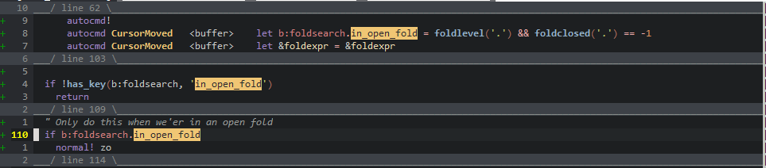

# fold_search.vim

Only see what you're searching for! :)

Just search the normal way you would, then type `zz`.

## Installation

```vim
call plug#begin()

" Used for cleanier code and reusable functions
Plug 'tjdevries/standard.vim'
" Used for configuration and generating menus/documentation
Plug 'tjdevries/conf.vim'
" The plugin you'd like to use :)
Plug 'tjdevries/fold_search.vim'

call plug#end()
```

## Usage

As mentioned before, trying searching for something. If you want to see only the lines that contain a match (as well as lines in the surrounding `context` (a configurable value of how many lines to show, defaulted to 1), type `zz`.

You'll then see something like this:



To leave this mode, type `zz` again!
